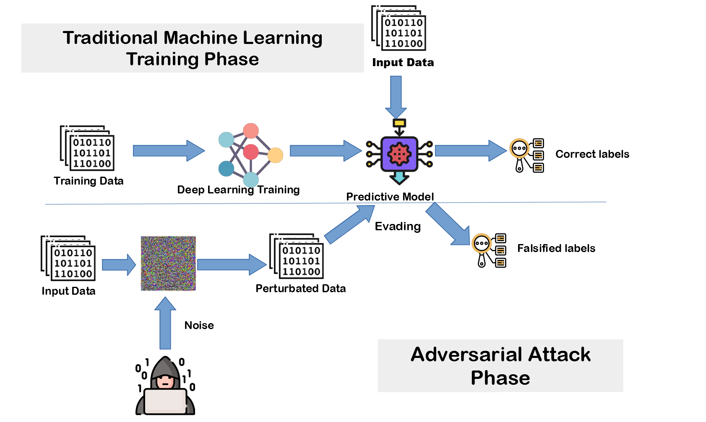

# Adversarial Attacks Comparison

### Experimental comparison of FGSM, PGD, and DeepFool, analyzing trade-offs between performance, perceptibility, and transferability

## Overview

This project implements and compares three classical adversarial attack methods — **FGSM**, **PGD**, and **DeepFool** — using **PyTorch**.  
Experiments are conducted on the **MNIST** and **CIFAR-10** datasets.

Our goal is to provide a **clear, reproducible, and interpretable** experimental study of how different attack strategies impact model robustness, visual perturbation quality, and computational cost.

**Deliverables include:**
- Clean and reproducible code
- Well-documented Jupyter notebooks
- Visual and quantitative results (accuracy vs ε + perturbation norms + visualisations)
- A concise **technical report** and **presentation slides**

This project is based on the methodologies introduced in two foundational research papers: 
- **[Towards Deep Learning Models Resistant to Adversarial Attacks](https://arxiv.org/pdf/1706.06083)** (2018)
- **[Explaining and Harnessing Adversarial Examples](https://arxiv.org/pdf/1412.6572)** (2015)

  

---

## Table of Contents

1. [Background & Motivation](#-background--motivation)
2. [Project Objectives](#-project-objectives)
3. [Implementation Plan (A–Z)](#-implementation-plan-a–z)
4. [What We Learned](#-what-we-learned)

---

## Background & Motivation

Deep neural networks can be fooled by tiny, imperceptible perturbations known as **adversarial attacks**, causing confident misclassifications. These weaknesses raise important concerns for the **security, reliability, and robustness** of modern ML systems.

Rather than designing new architectures, our project provides a **concise and reproducible comparison** of three standard white-box attacks to highlight key trade-offs:

- **Attack strength:** accuracy degradation  
- **Perturbation visibility:** L2 magnitude of the perturbation  
- **Computation cost:** efficiency of each attack  
- **Transferability:** effectiveness across models  

---

## Project Objectives

- **Implement** three major adversarial attacks using PyTorch:  
  - FGSM (Fast Gradient Sign Method)  
  - PGD (Projected Gradient Descent)  
  - DeepFool  

- **Evaluate** each attack on:  
  - Clean vs adversarial accuracy  
  - Perturbation norms (L2)  
  - Computation time  
  - Transferability across architectures  

- **Test** on two complementary datasets:  
  - **MNIST** – simple and interpretable  
  - **CIFAR-10** – more complex and realistic  

- **Deliver** clean and reproducible materials:  
  modular code, notebooks, visualizations, final report, and slides

### Optional Extensions
- Implement **PGD adversarial training** and compare “clean” vs “robust” models.

---

## Implementation Plan (A–Z)

### Phase 1 — Baselines
- Build PyTorch dataloaders (MNIST & CIFAR-10)  
- Load pretrained CNN/ResNet models  
- Implement helper functions (accuracy, visualization)

### Phase 2 — Attack Implementation
- **FGSM:** one-step gradient attack  
- **PGD:** iterative projected attack  
- **DeepFool:** minimal decision boundary perturbation  

### Phase 3 — Benchmarking & Analysis
- Run attacks with different ε values  
- Measure accuracy drop, perturbation magnitude, computation cost  
- Generate visual adversarial examples  

### Phase 4 — Defense Mechanism (Adversarial Training)
- Implement PGD-based adversarial training  
- Retrain models with adversarial examples  
- Compare robust vs clean performance  

---

# What We Learned : 

Throughout this project, we implemented and analyzed three major adversarial attacks : **FGSM**, **PGD**, and **DeepFool** on both MNIST and CIFAR-10. This allowed us to study how different attacks impact model predictions in terms of:

* Attack strength (accuracy drop under perturbations)
* Perturbation magnitude (L2 distances)
* Visual perceptibility of adversarial noise
* Transferability across datasets and models

### Key Findings
Each attack has its own strengths and characteristics. FGSM is a simple, single-step attack, which makes it very easy to implement and to understand. PGD is a much stronger iterative attack that can drastically reduce the accuracy of pretrained models. However, the effectiveness of both FGSM and PGD depends heavily on the choice of hyperparameters. This is where DeepFool is particularly strong, because it does not rely on additional parameters beyond the original data and model. 

A key finding of our experiments is the extreme vulnerability of standard neural networks: **even tiny, human-imperceptible perturbations can drop accuracy from 99% to 0% under strong iterative attacks such as PGD.**

To address this limitation, we implemented **PGD adversarial training**, a defense strategy where adversarial examples are generated during training so the model learns to resist them. This method, popularized by Madry et al. (2018), is considered the gold standard in adversarial robustness research.

Our results clearly demonstrate the benefits:
* A small reduction in clean accuracy (**98.7% → 97.1%**)
* A huge improvement in robustness, with PGD accuracy rising from **0%** (normal model) to **≈ 79%** (robust model)

This confirms that adversarial training greatly enhances model stability, making it significantly more resistant to gradient-based attacks.

**Overall, this project helped us understand:**
* How adversarial attacks exploit model gradients
* Why iterative attacks (PGD, DeepFool) are stronger than single-step attacks (FGSM)
* How robustness can be measured using accuracy curves, norms, and visualization
* Why adversarial defenses are essential for deploying ML models in safety-critical environments

### Unexplained Observations
In our experiments with the DeepFool attack on the MNIST dataset, we observed that the network often predicted the same adversarial label for many different perturbed inputs. Although this suggests some particular structure in the decision regions learned by the model, we were not able to identify a clear explanation for this behavior within the scope of this project.